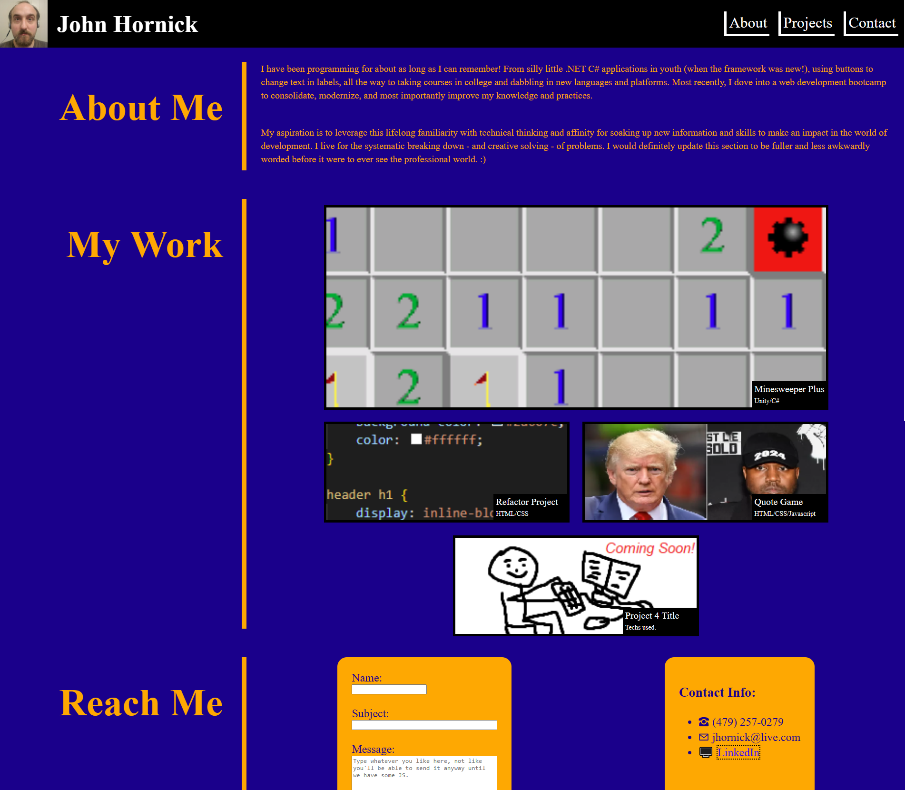

# My Project Portfolio

## Description

I created this website as a consolidated representation of me as a potential employee. It provides a summary of my background and what I'm looking for in a career, followed by links to various deployed projects of mine. Capping it off are multiple options for reaching me. It is responsively designed to be viewed on any device/at different resolutions.

## Installation

N/A

## Usage

Scroll or use nav links to browse content by section. Titled images function as links to my projects. No Linked-In profile is connected yet, nor does the contact form function without a back end. To view the deployed product, visit: https://hornickjohn.github.io/my-project-portfolio/

## Credits

N/A

## License

N/A

## As-Deployed Screenshot

